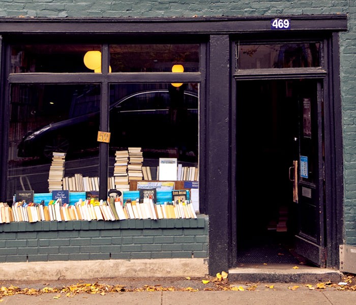

> In the beginning was the word…

I moved to Montréal to follow my girlfriend. She had been accepted to a two year masters at McGill in Urban Planning. Sitting in a cafe in Union Square, one of the dozens of urchin-like cutouts named ‘squares’ in Cambridge, she asked if I would like to come and stay there with her. 

*Why not?* I responded. Cambridge has its appeals; Harvard, MIT, the T, Dunkin Donuts, the museum - but it has a dearth of a couple of things. One of them is hills, and the other is foreignness. Boston was the only major city in New England, near where I grew up. Montréal - on the other hand - was exotic, foriegn, somewhere between the Arctic and the illustrious northern ski slopes of Vermont.

When we drove up, I wondered if I would be able to bring all of my books. I had been amassing a collection by visiting second hand shops, Good Wills, and the occasional visit to the Harvard Coop. My landlord worried about the weight of the books on my shelves, peering into my room as if it was as explosive as a ship’s magazine. I decided not to bring more than a hundred, and stuffed the rest in storage in the outskirts of the city. Going north, I knew I had to find replacements. The feeling of home, for me, is directional proportional to the amount of books on the shelf.

And so, after walking through McGill’s campus, already clad in autumnal robes in preparation for the fall semester, I looked for bookshops. Down one street on the way home, in a black-painted brick building that looked like a ramshackle érablière, I found The Word.

On nice days, they have books lined up outside, beneath the window, marked with red pen to show that they’re a dollar each (and thus, probably, not worth stealing). Thumbing through my shelves, I can identify some of these honeypots by their appellative mark. Descartes _Discourse on Method_. _Parzival._ A book of truly appalling poetry by a man from Victoria Island, who seems to love rainbows and hating hippies with ironic glee (self published). Chaucer’s _Canterbury Tales_. An adventure book. Another about Palestine.

I was caught, hook, line, and sinker.

The Word is a family run business. The owner set it up after a laundromat there in the 70s went out of business. Attached to McGill at the time, he started selling his books out of the store instead of from his bedroom. He’s still there, although his beard has grown greyer. His wife and son occasion the store, the son a stork walking around with a black beanie, a hipster coat, and the permanent sniff of a poet (he’s probably a nice guy). He runs the newsletter, for this and another English bookshop in Montréal, The Black Rose. Occasionally, there’s another keeper, with immaculate round glasses and eyes set to stare over them, like a math teacher. 

They sit in the corner, underneath the stairs to the office above. In the middle of the single room is a long, low table, with a short space between it and a bookcase divider, shutting off the rest of the discount books from the view of the register (almost as if in distaste). The best books are on display on the table - Heinlein, Kant, Yeats, Norman, Plato, Mishima, etc, etc.  If you’d like to know their selection, there’s a rack on the wall to your left when you open the door, most often with poetry. They also send out a  newsletter.

Fiction, crime, philosophy, essays, biography. They don’t get much fantasy literature, or bodice rippers, for that matter. But all the good stuff, straight from ex-students and adjuncts and the English Quebecer literati. If you want to sell, they buy - but not a single book has a mark in it. If they find an underline in a book, it becomes a dollar book immediately (five shelves, behind the door on the right, as well as in the window).  
  
When they have local poets, they set up a table, some chairs. Standing room only is the norm (from what I’ve seen). At less than a couple of minutes from McGill, in the heart of the student ghetto, this makes sense. Some of the audience will buy a “The Word” t-shirt, black with a typewriter on it. Or a tote bag. You’ll see them around town, too, if you look.

In short, the perfect little shop. Ask for a recommendation. Peruse at will. Close the door behind you, when you go in. Cash only - there’s an ATM in the depanneur across the street. Don’t worry, they’ll hold your books for you while you go.